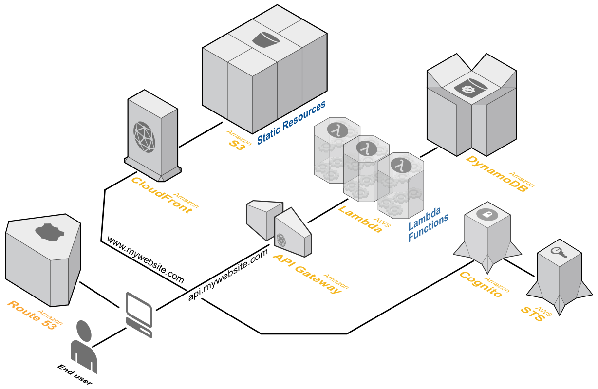

# Serverless

more dev, less ops?

---

### Which serverless?

- [Serverless Computing:](https://en.wikipedia.org/wiki/Serverless_computing) Functions-as-a-service, run applications with less infrastructure management
- [Serverless Framework:](https://github.com/serverless/serverless) 3rd-party tools for easier serverless development across several cloud providers
- [Serverless Application Model:](https://github.com/awslabs/serverless-application-model) AWS specification and tools to develop serverless apps more easily

--


--

[](https://github.com/awslabs/lambda-refarch-webapp)
<!-- .slide: data-background="#fff" -->

---

### AWS Lambda


--

### Code execution as a service

- No servers, SSH keys, networks, IP addresses
- Python 2.7, Node 4.3, Java 8, C#
- Automatic scaling, each request is handled individually
- Charged by code execution time for each 100ms
- Metrics, logging, versioning

--

### AWS API Gateway


--

### HTTPS Proxy as a service

- Proxying, schemas, transformations
- Authorization (API keys), throttling, quota
- Stages (dev, prod...) & versioning
- Caching
- SDK generation

---

### Life improvements

- [Environment Variables:](https://aws.amazon.com/blogs/aws/new-for-aws-lambda-environment-variables-and-serverless-application-model/) variate function without changing and redeploying code.
- Run Lambdas on CloudFront [edge locations](https://aws.amazon.com/blogs/aws/coming-soon-lambda-at-the-edge/).
- Native Swagger support instead of [separate tool](https://github.com/awslabs/aws-apigateway-importer).
- Define and deploy functions and interfaces in [Serverless Application Model](https://github.com/awslabs/serverless-application-model) YAML.
- Much simpler [Gateway-Lambda Proxy](http://docs.aws.amazon.com/apigateway/latest/developerguide/api-gateway-set-up-simple-proxy.html) integration without template mapping.

--

### Simpler Lambda Proxy


---

### AWS Serverless Application Model

- Additions to CloudFormation syntax and AWS CLI tools
- Describe Lambda functions and their API Gateway routing in a single YAML file
- Much simple than the API Gateway Swagger Extensions

--

<pre><code data-trim="" class="yaml">
AWSTemplateFormatVersion: '2010-09-09'
Transform: AWS::Serverless-2016-10-31
Resources:
  GetFunction:
    Type: AWS::Serverless::Function
    Properties:
      Handler: index.get
      Runtime: nodejs4.3
      Policies: AmazonDynamoDBReadOnlyAccess
      Environment:
        Variables:
          TABLE_NAME: !Ref Table
      Events:
        GetResource:
          Type: Api
          Properties:
            Path: /resource/{resourceId}
            Method: get
  Table:
    Type: AWS::Serverless::SimpleTable
</code></pre>

--

### Deploying is easy, right?

First we preprocess the cloudformation template

    aws cloudformation package
      --template-file original.yml
      --output-template-file compiled.yml
      --s3-bucket mahbucket

Then we deploy the cloudformation stack

    aws cloudformation deploy
      --template-file compiled.yml
      --stack-name mahstack
      --capabilities CAPABILITY_IAM

--

- Function deployment is slow via CloudFormation change sets
- You have to manually create a bucket where to upload your code
- No way to exclude files in deployment
- No local invocation of functions
- No easy way to view logs

--

So I'll just write some wrapping...

```
#!/bin/bash
set -euo pipefail
IFS=$'\n\t'
function deps {
  rm -rf ../build
  mkdir -p ../build
  pip install -r requirements.txt -t ../build/
}
function package {
  cp -rf {tweet,healthcheck} ../build/
  cp -f {*.py,sam.yml} ../build/
  cd ../build
  aws cloudformation package --template-file killMeNow.yml
}
```

...Uhh, how did I get here?

--

*"Conclusion: Creating, deploying and managing a serverless app **has never been easier**."*

---

### [Serverless Framework](https://serverless.com/)

- Easy deployment! Fast function updates! Automatically create artifact bucket!
- Invoke from your terminal! Logs in your terminal! Run functions locally!
- Supports AWS Lambda, Google CloudFunctions and Azure Functions
- Not convinced? Plugins!

--

<pre><code data-trim="" class="python">
sudo npm install -g serverless
sls create --template aws-nodejs

sls deploy -v
sls deploy function -f fetcher

sls invoke -f fetcher -l
sls logs -f fetcher -t

sls remove
</code></pre>

--

<pre><code data-trim="" class="yaml">
service: acme-service
custom:
  acmeVariable: acme-variable
provider:
  name: aws
functions:
  acmeApiFunction:
    handler: api.get_item
    events:
      - http: GET items/{id}
package:
  exclude:
    - "do_not_upload_me.txt"
resources:
  Resources:
    AcmeDynamoTable:
      Type: AWS::DynamoDB::Table
</code></pre>

--


--

### What about the frontend assets?

- **[serverless-single-page-app-plugin](https://github.com/serverless/examples/tree/master/aws-node-single-page-app-via-cloudfront)**
  - Requires a lot of (CloudFront) configuration
- **[serverless-client-s3](https://github.com/serverless/serverless-client-s3)**
  - Requires a fork to support latest Serverless
  - Does not delete bucket if renamed
  - Does not create Route53 DNS Record or CloudFront distribution

---

### Conclusions

[Serverless Framework](https://serverless.com/)

[AWS Serverless Architecture Whitepaper](https://d0.awsstatic.com/whitepapers/AWS_Serverless_Multi-Tier_Architectures.pdf)

[Vogels' Blog: Reference Architectures](http://www.allthingsdistributed.com/2016/06/aws-lambda-serverless-reference-architectures.html)
